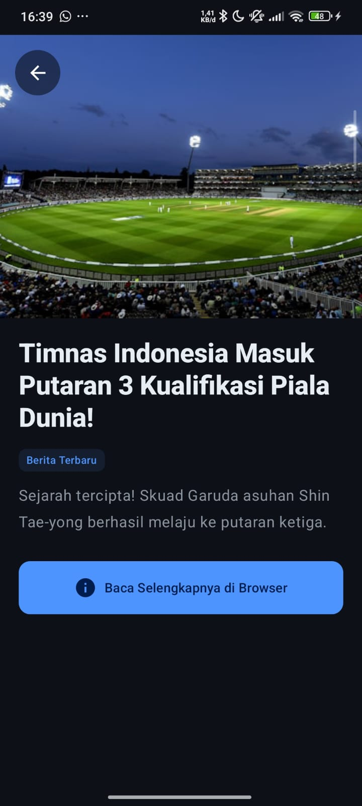
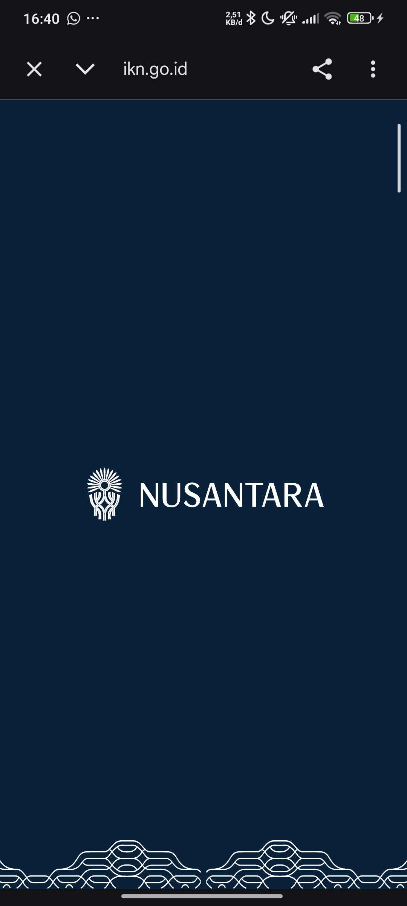

# 📰 NewsReaderApp - Berita Indonesia

**NewsReaderApp** adalah aplikasi pembaca berita modern berbasis Android yang dirancang dengan pendekatan *Offline-First*. Aplikasi ini mensimulasikan pengambilan data berita terkini menggunakan **Ktor Client** dan menyimpannya secara otomatis ke dalam **Room Database** (penyimpanan lokal), sehingga pengguna tetap dapat membaca berita meskipun tanpa koneksi internet. Antarmukanya dibangun menggunakan **Jetpack Compose** dengan tema **"Fresh Matcha"** yang mengedepankan estetika minimalis dan kenyamanan visual.

## 🚀 Penjelasan Singkat Aplikasi
Aplikasi ini memungkinkan pengguna untuk menjelajahi berbagai berita populer di Indonesia. Dengan fitur sinkronisasi data, aplikasi akan melakukan *refresh* konten setiap kali pengguna melakukan aksi penyegaran. Fitur utama meliputi daftar berita dengan efek Shimmer yang estetik, halaman detail berita yang mendalam, dan kemampuan untuk membuka artikel asli melalui integrasi browser internal (Chrome Custom Tabs).

## 🔌 API yang Digunakan
Aplikasi ini mengimplementasikan logika pengambilan data melalui:
- **Networking (Ktor Client):** Digunakan sebagai mesin networking untuk menangani pengambilan data berita secara asinkron dari sumber remote (simulasi API).
- **Local Persistence (Room Database):** Digunakan untuk menyimpan data yang berhasil diambil ke dalam database SQLite lokal sebagai mekanisme *caching* berita agar bisa diakses sepenuhnya secara luring.

## 📸 Screenshots (Semua State)
Berikut adalah visualisasi antarmuka aplikasi dalam berbagai kondisi:

| **Loading State** (Shimmer) | **Success State** (Home) | **Error State** (Disconnected) |
| :---: | :---: | :---: |
|  |  |  |

| **Detail Berita** | **Tampilan Browser** |
| :---: | :---: |
|  |  |

## 🎥 Video Demonstrasi (30 Detik)
Video demo berikut menunjukkan alur fungsionalitas aplikasi secara lengkap (durasi ~30 detik), yang mencakup:
1. Proses **Loading** awal dengan efek Shimmer.
2. Transisi ke data **Success** saat berita berhasil dimuat.
3. Simulasi tampilan saat terjadi **Error** (kegagalan koneksi).
4. Fungsi **Refresh** untuk memperbarui daftar berita secara dinamis.

[Klik di sini untuk menonton Video Demo](https://github.com/user-attachments/assets/e4ab596f-f0e0-48d0-8468-05a4cdeb3996)

## 🛠️ Tech Stack
- **UI Framework:** Jetpack Compose (Material 3)
- **Networking:** Ktor Client
- **Local Database:** Room Persistence Library
- **Image Loading:** Coil Compose
- **Architecture:** MVVM (Model-View-ViewModel)
